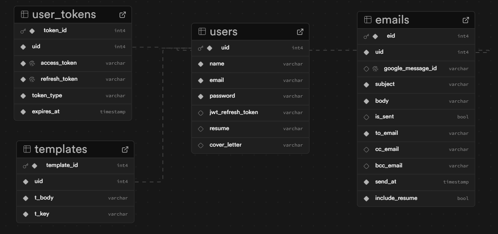

# MailMerger Backend

MailMerger-backend is a robust and scalable backend API designed for managing personalized email campaigns with advanced features like template management, email queueing, and user authentication. Built with FastAPI, SQLAlchemy, and Redis, it supports efficient email processing and template storage for high-performance applications.

---

## Table of Contents

- [Features](#features)
- [Tech Stack](#tech-stack)
- [Project Structure](#project-structure)
- [Setup and Installation](#setup-and-installation)
- [Configuration](#configuration)
- [Database Schema](#database-schema)
- [API Overview](#api-overview)
  - [Authentication & User](#authentication--user)
  - [Email Queue](#email-queue)
  - [Templates](#templates)
  - [Storage](#storage)
- [Frontend Repository](#frontend-repository)
- [Background Tasks](#background-tasks)
- [Development & Testing](#development--testing)
- [Contribution](#contribution)
- [License](#license)

---

## Features

- **User Authentication:** JWT-based login, signup, and refresh tokens. OAuth support (Google).
- **Email Queue:** Queue emails for asynchronous sending, retrieve or delete queued emails.
- **Template Management:** Create, manage, and cache email templates per user.
- **Storage Integration:** Connects to Supabase S3 for file storage needs.
- **Database:** Uses SQLAlchemy ORM with PostgreSQL (configurable).
- **Caching:** Heavy use of Redis for caching templates and email queues for fast access.
- **Background Processing:** Celery tasks for sending emails in the background.
- **Configurable CORS:** Supports cross-origin requests from configurable origins.

---

## Tech Stack

- **Framework:** FastAPI (Python)
- **ORM:** SQLAlchemy
- **Database:** PostgreSQL (via `DB_CONNECTION_URL`)
- **Cache:** Redis (local/cloud, configurable)
- **Task Queue:** Celery (for background email sending through redis queue)
- **Storage:** Supabase S3
- **Auth:** JWT, OAuth (Google)

---

## Project Structure

```
app/
  ├── main.py              # FastAPI app entry point, middleware & router registration
  ├── models/              # SQLAlchemy models (User, Email, Template, etc.)
  ├── routes/              # API route definitions (auth, email, template, queue, storage)
  ├── utils/               # Utility functions & configuration
  ├── db/                  # Database & Redis connection setup
  ├── pydantic_schemas/    # Request/response validation schemas
  └── tasks/               # Celery tasks for background jobs
```

---

## Setup and Installation

### Prerequisites

- Python 3.10+
- PostgreSQL database
- Redis server (local or cloud)
- Supabase account (for S3 storage)
- [Optional] Celery worker (for background email sending)

### Steps

1. **Clone the repository:**
   ```bash
   git clone https://github.com/manas-1404/MailMerger-backend.git
   cd MailMerger-backend
   ```

2. **Install dependencies:**
   ```bash
   pip install -r requirements.txt
   ```

3. **Configure environment variables:**
   - Copy `.env.example` to `.env` and fill in all required values (see [Configuration](#configuration) below).

4. **Run database migrations:**
   > Tables are auto-created at FastAPI startup, but for production, set up migrations via Alembic if needed.

5. **Start the FastAPI server:**
   ```bash
   uvicorn app.main:app --reload --host localhost --port 8000
   ```

6. **[Optional only if sending batched emails] Start Celery worker:**
   ```bash
   celery -A app.celery_worker worker --loglevel=info --pool=solo
   ```

---

## Configuration

All critical settings are controlled via environment variables (see `app/utils/config.py`):

- `DB_CONNECTION_URL` - PostgreSQL connection string
- `REDIS_HOST`, `REDIS_SERVER_PORT`, `REDIS_SERVER_DB` - Redis config (local)
- `REDIS_CLOUD_*` - Redis config (cloud)
- `SUPABASE_ACCESS_KEY_ID`, `SUPABASE_SERVICE_ROLE` - Supabase credentials
- `SUPABASE_S3_STORAGE_ENDPOINT`, `SUPABASE_S3_STORAGE_REGION` - Supabase S3 config
- `JWT_SIGNATURE_SECRET_KEY`, `JWT_AUTH_ALGORITHM` - JWT auth secrets
- `GOOGLE_CLIENT_ID`, `GOOGLE_CLIENT_SECRET` - Google OAuth credentials
- `ALLOWED_ORIGINS` - CORS allowed origins

See `app/utils/config.py` for the full list.

---

## Database Schema

The backend uses PostgreSQL with four main tables: **users**, **user_tokens**, **templates**, and **emails**. The design keeps data organized, avoids duplication, and makes it easy to extend or scale.

### 1. `users`

Stores core account information.

- **Fields:**
  - `uid` (PK): Unique user ID.
  - `name`, `email`, `password`: Basic user profile and login details.
  - `jwt_refresh_token`: Token used for refreshing login sessions.
  - `resume`, `cover_letter`: File references for attachments (stored in Supabase storage) (accessed using object links).

- **Purpose:** Acts as the main reference point for other tables.

---

### 2. `user_tokens`

Stores tokens for external services (e.g., Google API).

- **Fields:**
  - `token_id` (PK): Unique token record.
  - `uid` (FK → users.uid): User that owns the token.
  - `access_token`, `refresh_token`, `token_type`, `expires_at`: Google OAuth, Gmail Service API token details.

- **Purpose:** OAuth tokens are separated from primary user login data to simplify token rotation and expiry handling.

---

### 3. `templates`

Stores user-created email templates for personalization and reuse.

- **Fields:**
  - `template_id` (PK): Unique template record.
  - `uid` (FK → users.uid): User that owns the template.
  - `t_body`: Template content (HTML/text).
  - `t_key`: Identifier or key for quick lookups.

- **Purpose:** Lets users create multiple reusable templates without duplicating content in emails.

---

### 4. `emails`

Represents queued or sent emails for campaigns.

- **Fields:**
  - `eid` (PK): Unique email record.
  - `uid` (FK → users.uid): Owner of the email.
  - `google_message_id`: Reference for tracking emails via Google API.
  - `subject`, `body`: Email content.
  - `to_email`, `cc_email`, `bcc_email`: Recipient details.
  - `is_sent`: Status flag indicating if the email is sent.
  - `send_at`: Scheduled time to send the email.
  - `include_resume`: Boolean flag to include user’s resume as an attachment.

- **Purpose:** Allows managing large volumes of emails without repeating user or template data.

---

### Relationships

- One user can have multiple tokens (`1 users → M user_tokens`).
- One user can have multiple templates (`1 users → M templates`).
- One user can send or queue multiple emails (`1 users → M emails`).

---

### Visual Schema



### Why I designed the schema the way it is??

I designed this database schema to be **clean, scalable, and easy to maintain** as the system grows. A big part of that was applying **normalization** so that data is stored in the right place without duplication. The database schema is in 3NF. 

#### How I applied normalization

- **First Normal Form (1NF):**  
  Every table has a primary key and each column stores a single value. For example, `to_email`, `cc_email`, and `bcc_email` are separate columns instead of one combined field.

- **Second Normal Form (2NF):**  
  Non-key fields depend entirely on the table’s primary key. In `templates`, every attribute depends on `template_id` and nothing depends partly on `uid`.

- **Third Normal Form (3NF):**  
  There are no transitive dependencies. Data in each table depends only on its own primary key. For example, `emails` references `users` via `uid` instead of storing user details like name or email directly.


## API Overview

### Authentication & User

- **Endpoints:**
  - `POST /api/auth/login` - Login and receive JWT token
  - `POST /api/auth/signup` - Register new users
- **Details:**
  - Credentials verified against hashed passwords.
  - On login, user's templates are cached in Redis for faster access.
  - JWT and refresh tokens are set as cookies.

### Email Queue

- **Endpoints:**
  - `GET /api/queue/get-email-queue` - Retrieve queued emails for the user
  - `POST /api/queue/add-to-queue` - Add an email to the queue
  - `POST /api/queue/send-queued-emails` - Send queued emails (processed via Celery)
  - `DELETE /api/queue/delete-queue-email` - Remove emails from the queue
- **Details:**
  - Queues are stored in Redis for performance, fallback to DB if not cached.
  - Email sending is performed asynchronously via Celery background worker.

### Templates

- **Endpoints:**
  - `GET /api/templates/get-all-templates` - Fetch all templates for authenticated user
  - `POST /api/templates/add-template` - Add a new template
  - Other CRUD template endpoints available.
- **Details:**
  - Templates are cached in Redis for each user to minimize DB queries.
  - All cache operations have expiry set for performance and consistency.

### Storage

- **Endpoints:**
  - Storage endpoints connect to Supabase S3; see `app/routes/storage_routes.py` for details.

---

## Background Tasks

- **Celery** is used for sending emails in the background.
- When a user requests to send queued emails, `send_emails_from_user_queue` Celery task is triggered.
- Ensure that the Celery worker is running and configured to connect to the same Redis instance as the server.

---

## Frontend Repository

The frontend code for this project is available at:  [@manas-1404/MailMerger-frontend](https://github.com/manas-1404/MailMerger-frontend)
Please refer to the frontend repository for setup instructions and all client-side logic.

---

## Development & Testing

- **Run locally:** Follow setup instructions above.
- **Testing:** Add tests in a `tests/` directory and use `pytest` for running them.
- **Hot reload:** Use `uvicorn ... --reload` for auto-reloading during development.

---

## Contribution

Contributions are welcome! Please open issues or submit pull requests with improvements or bug fixes.

---

## License

MIT License. See [LICENSE](LICENSE) for details.
